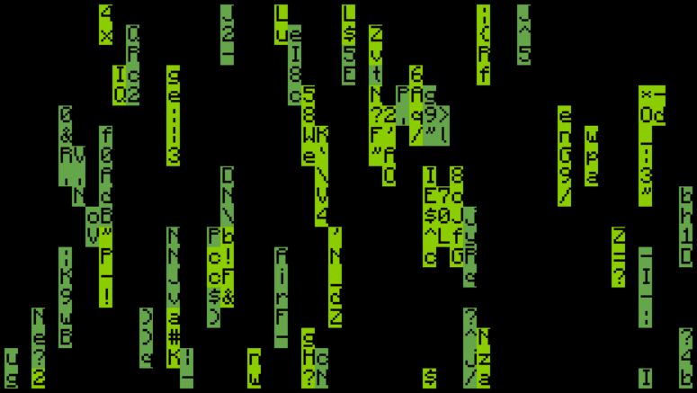

# Hi, I am Evan (Big) Cheung 🐤
I am a software engineer and game development hobbyist with a degree in Computer Science from UCLA. I have worked as a Full-Stack Web Developer for 3 years, and first learned coding when I taught myself to make video games at the age of 9. I have a passion for general problem solving, leadership, and anything related to education! I have most of my code locally backed up, in private repos, on Replit, or on Pastebin, so forgive me if my Github looks a little sparse.

>[!NOTE]
>Hover over the images to read a short description, and click to visit if they have a link

## Projects by date

  
  

    <h3>UCLA</h2>
  

  

  
  
    
  

  
  
  

  
  

  

  
<h3>High School</h2>

  My high school projects were mainly projects completed for a game development course at Harvard Summer School and my senior project.
  

  
<h3>Before High School</h2>

  Most of my Pre-High school projects were done in Lua for a game engine named Love2D as well as for a mock-UNIX shell available as a mod for minecraft named ComputerCraft. These screenshots are from ComputerCraft, which has an extremely barebones graphical display (51 x 19 ASCII characters) and an input library. It supports 4 bit color. Hover over each to read a short description.
  

      
      
  

  

    
    
  

